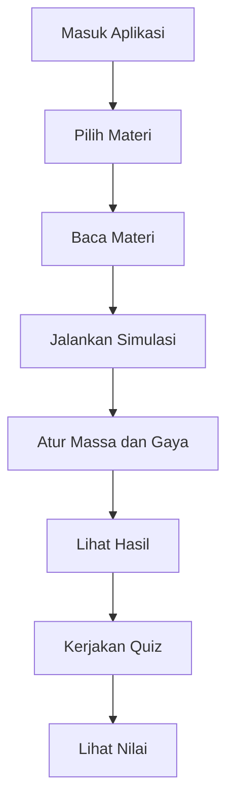
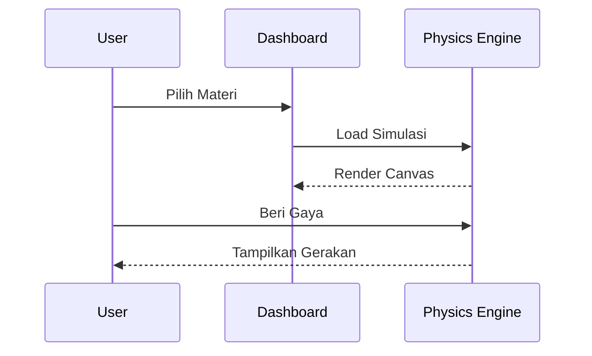
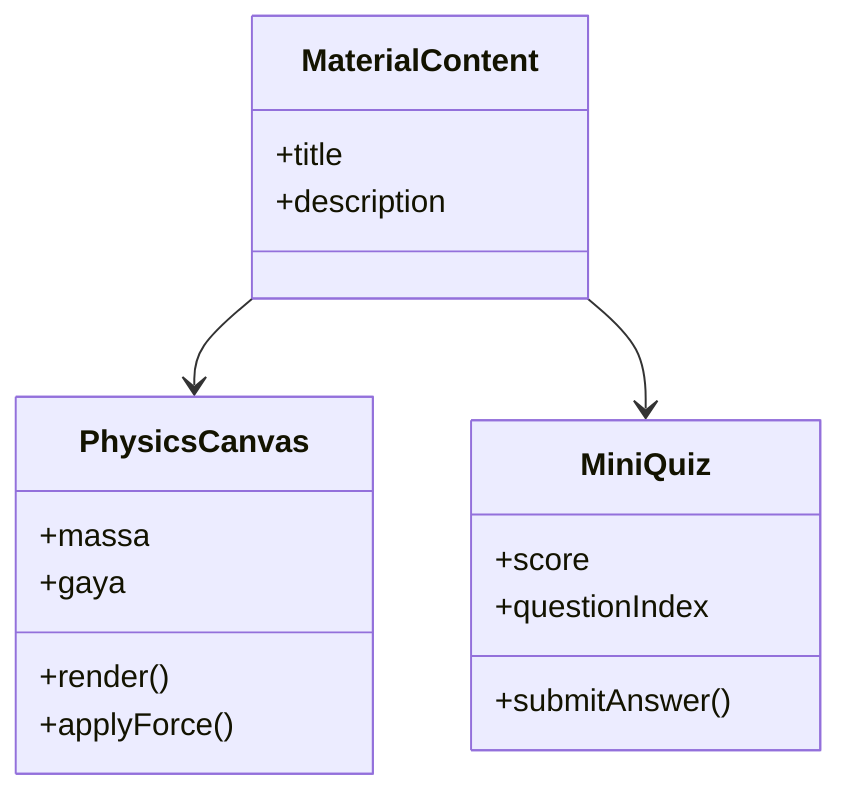

# SOFTWARE DESIGN DOCUMENT (SDD)
# Web Edukasi & Simulasi Interaktif Hukum Newton

**Versi:** 2.0  
**Teknologi:** Next.js, React, Matter.js, Tailwind CSS, TypeScript  
**Dokumen:** Software Design Document (SDD)

---

# 1. Executive Summary

Aplikasi ini merupakan platform pembelajaran fisika berbasis web yang menyediakan materi Hukum Newton, simulasi interaktif menggunakan Matter.js, serta evaluasi pembelajaran melalui kuis interaktif.

Tujuan utama sistem adalah meningkatkan pemahaman konsep fisika melalui pendekatan visual, eksperimen digital, dan pembelajaran mandiri.

---

# 2. Tujuan Sistem

- Menyediakan pembelajaran Hukum Newton secara interaktif.
- Memvisualisasikan konsep fisika menggunakan simulasi.
- Membantu siswa memahami hubungan gaya, massa, dan percepatan.
- Menyediakan evaluasi pembelajaran berbasis kuis.

---

# 3. Ruang Lingkup

## In Scope

- Materi Hukum Newton I
- Materi Hukum Newton II
- Materi Hukum Newton III
- Simulasi berbasis Matter.js
- Mini Quiz
- Dashboard Pembelajaran
- Responsive UI

## Out of Scope

- Login pengguna
- Database permanen
- Penyimpanan cloud
- Sistem LMS penuh

---

# 4. Kebutuhan Fungsional

## FR-001 Menampilkan Materi Newton I

Sistem harus mampu menampilkan materi Hukum Newton I beserta ilustrasi dan simulasi.

## FR-002 Menampilkan Materi Newton II

Sistem harus mampu menampilkan konsep:

F = m × a

## FR-003 Menampilkan Materi Newton III

Sistem harus mampu menampilkan konsep aksi dan reaksi.

## FR-004 Simulasi Interaktif

Pengguna dapat:

- Mengubah massa
- Mengubah gaya
- Menjalankan simulasi
- Mengulang simulasi

## FR-005 Quiz

Pengguna dapat:

- Menjawab soal
- Melihat skor
- Mengulang kuis

---

# 5. Kebutuhan Non-Fungsional

## NFR-001 Performance

Waktu loading maksimal 3 detik.

## NFR-002 Availability

Sistem dapat diakses 24/7.

## NFR-003 Compatibility

Mendukung:

- Chrome
- Edge
- Firefox
- Safari

## NFR-004 Security

- Validasi input
- Sanitasi data
- Proteksi XSS dasar

## NFR-005 Accessibility

- Keyboard Navigation
- Responsive Design
- Kontras warna memadai

---

# 6. Arsitektur Sistem

```text
User
 │
 ▼
Next.js Frontend
 │
 ├── Materi
 ├── Simulasi
 └── Quiz
 │
 ▼
Matter.js Physics Engine
```

---

# 7. Use Case Diagram

```text
+------------------+
|      User        |
+------------------+
        |
        |
        +------------------+
        |                  |
        ▼                  ▼
 Melihat Materi      Menjalankan Simulasi
        |
        ▼
 Mengerjakan Quiz
```

---

# 8. Activity Diagram



---

# 9. Sequence Diagram



---

# 10. Class Diagram



---

# 11. Struktur Folder

```text
src/
│
├── app/
│   ├── layout.tsx
│   └── page.tsx
│
├── components/
│   ├── PhysicsCanvas.tsx
│   ├── MiniQuiz.tsx
│   ├── MaterialText.tsx
│   └── Navbar.tsx
│
├── data/
│   └── questions.ts
│
├── hooks/
│
├── types/
│
└── utils/
```

---

# 12. Desain Data

```ts
interface Question {
  id: number;
  question: string;
  options: string[];
  correctAnswer: number;
}

interface QuizState {
  currentQuestionIndex: number;
  score: number;
  isFinished: boolean;
}
```

---

# 13. Desain Simulasi

## Newton I

- Gesekan = 0
- Benda bergerak konstan

## Newton II

- Variabel massa
- Variabel gaya
- Percepatan dihitung otomatis

a = F / m

## Newton III

- Simulasi tumbukan
- Visualisasi aksi-reaksi

---

# 14. Desain Keamanan

## Frontend Security

- Input Validation
- Sanitization
- Error Handling

## Dependency Security

- npm audit
- Dependabot

## Browser Security

- CSP Header
- XSS Protection
- Clickjacking Protection

---

# 15. API Design (Future)

## GET /api/materials

Mengambil daftar materi.

## GET /api/questions

Mengambil soal kuis.

## POST /api/quiz/submit

Mengirim hasil kuis.

---

# 16. Deployment Architecture

```text
Developer
    |
    ▼
GitHub
    |
    ▼
Vercel
    |
    ▼
Production
```

---

# 17. Testing Strategy

## Unit Testing

- PhysicsCanvas
- MiniQuiz

## Integration Testing

- Dashboard
- Routing

## User Acceptance Testing

- Simulasi berjalan
- Quiz berjalan
- Nilai tampil

---

# 18. Performance Requirement

- FCP < 2 detik
- LCP < 3 detik
- CLS < 0.1

---

# 19. Future Development

## Versi 2.0

- Login User
- Leaderboard
- Database PostgreSQL

## Versi 3.0

- AI Tutor
- Analitik Pembelajaran
- Gamifikasi

---

# 20. Kesimpulan

Platform ini dirancang sebagai media pembelajaran fisika modern yang menggabungkan teori, eksperimen virtual, dan evaluasi pembelajaran dalam satu sistem terintegrasi berbasis Next.js dan Matter.js.
